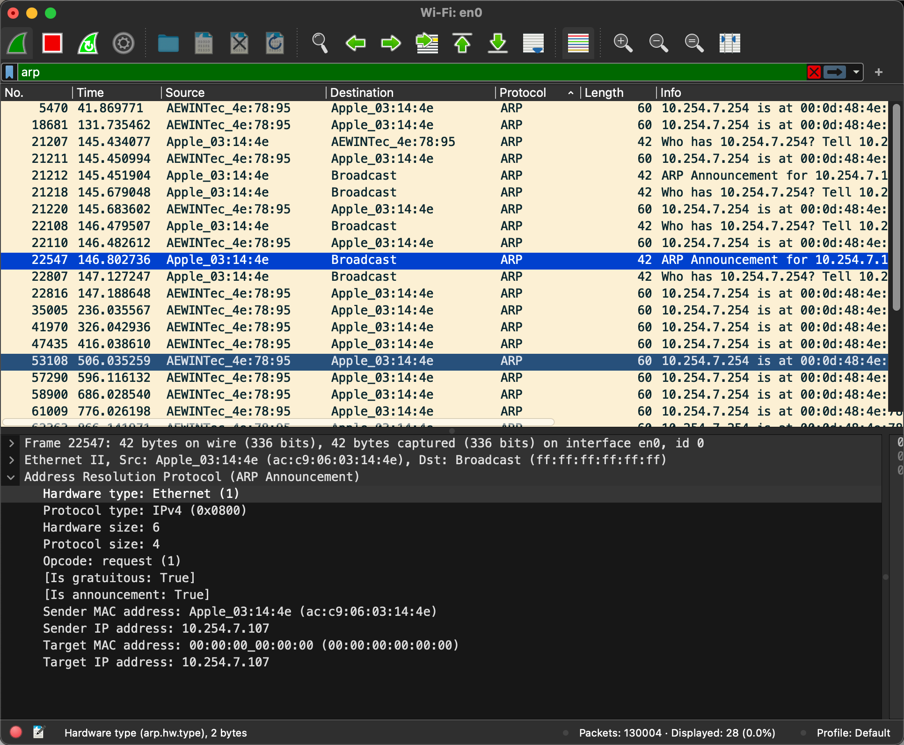
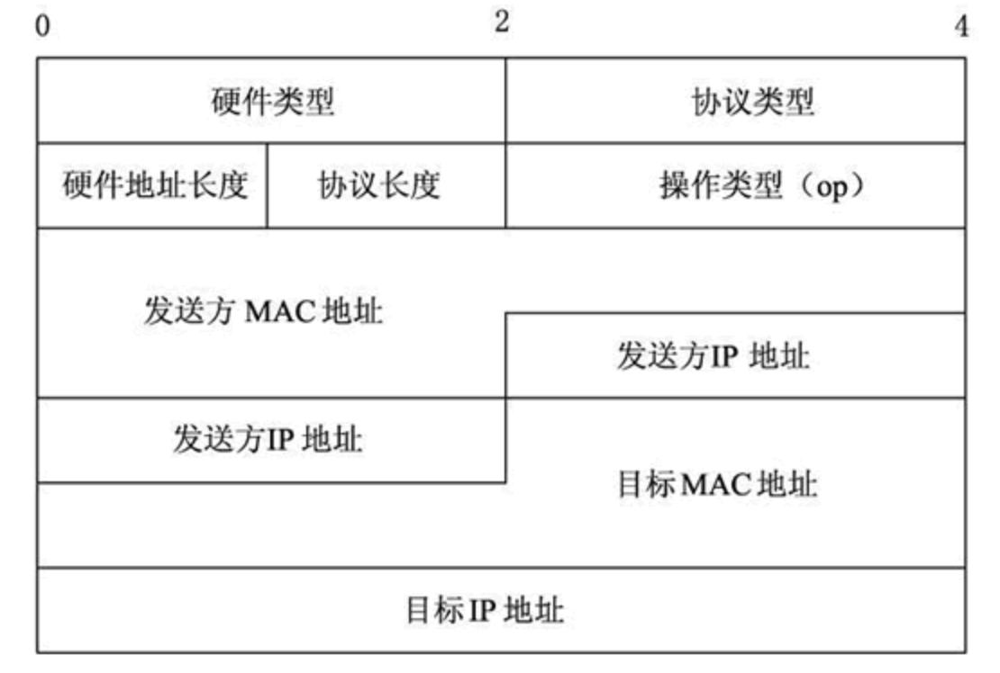
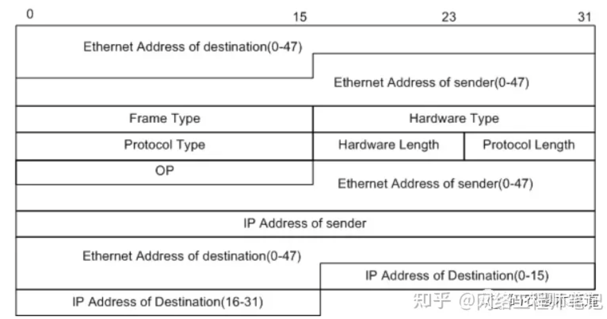

# ARP

Address Resolution Protocol

# Gratuitous ARP/ ARP Announcement

免费ARP、ARP通告

# ARP message

# ARP query mesage

| 0-7               | 8-15            | 16-23          | 24-31 |
| ----------------- | --------------- | -------------- | ----- |
| Hardware Type     |                 | Protocol Type  |       |
| Hardware Length   | Protocol Length | Operation Code |       |
| Sender MAC Adress |                 |                |       |
| Sender IP Adress  |                 |                |       |
| Target MAC Adress |                 |                |       |
| Target IP Adress  |                 |                |       |

# ARP response message

