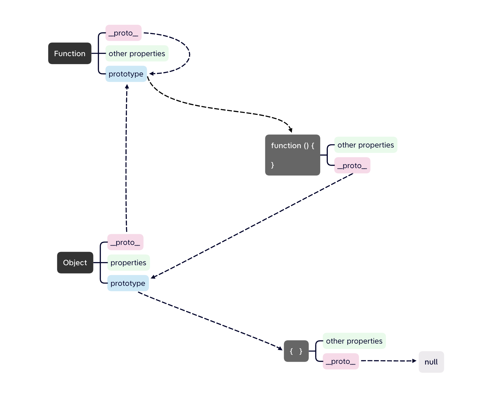
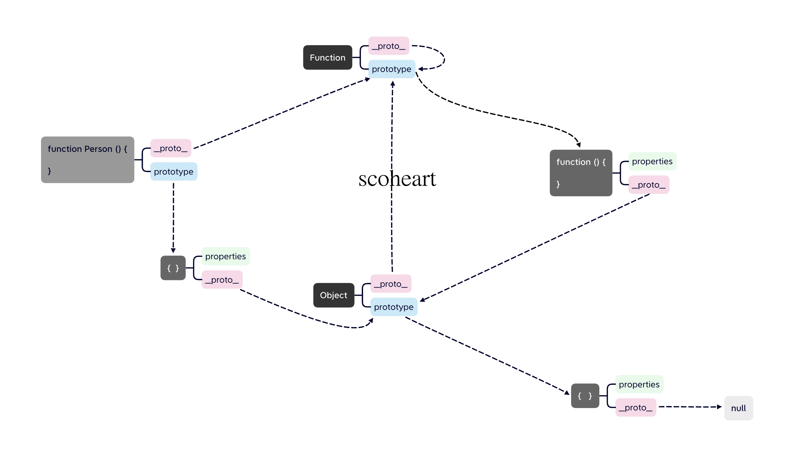
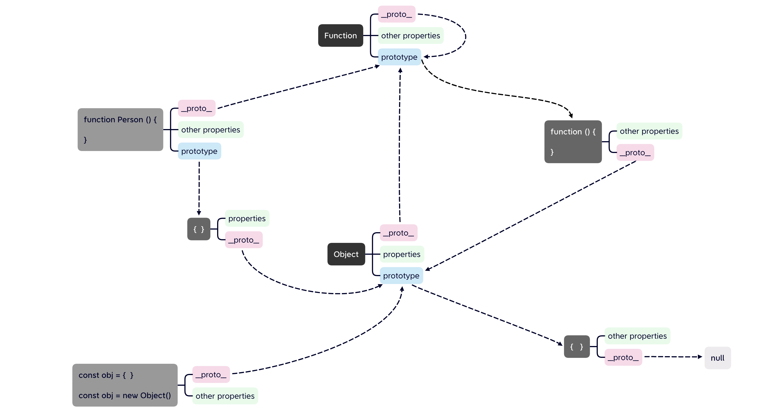

# prototype

每一个函数身上都有的一个property

指向堆内存空间的一个实例对象


# _ _ proto _ _

每一个实例对象身上都有的一个property

指向其构造函数身上的 prototype 属性


# prototype & _ _ proto _ _

每一个实例对象身上的 _ _ proto _ _ 属性都指向

其构造函数的 prototype 属性

其构造函数的 prototype 属性则指向 堆内存 空间中的一个实例对象


# Function

## _ _ proto _ _

是Function的一个实例对象

其proto指向其构造函数的prototype：Function.prototype


## prototype

Function 是一个构造函数

其prototype指向堆内存空间的一个实例对象


### Function.prototype

是一个实例对象 且 该实例对象是一个函数

其proto属性指向 Object.prototype

证明其是Object构造函数构造出来的

```js
Function.prototype instanceof Object
```


## Function -->

```js
Function.__proto__ --> Function.prototype --> fn()
fn().__proto__ --> Object.prototype
```


# Object

## _ _ proto _ _

Object也是一个实例对象

proto指向Function.prototype


## prototype

Object 是一个构造函数

其prototype指向堆内存空间的一个实例对象


### Object.prototype

是一个实例对象，则有proto属性

其proto是原型链顶端 为null 

不再指向任何堆内存空间？？？


## Object -->

```js
Object.__proto__ --> Function.prototype

Object.prototype --> {} 
{}.__proto --> null
```


# others

Function.prototype 是 Object 的实例对象

Object 是 Function 的实例对象





