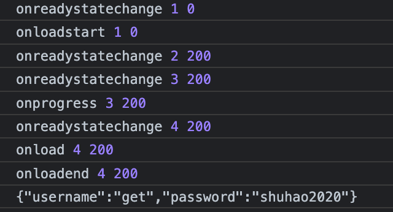

# js原生请求对象

浏览器环境

- XHR
- AtiveXObject

node

- http


# life cycle

- 0 UNSENT
  - new 了对象 但是没有调用open
- 1 OPENED
  - open调用了 但是没有调用 send
- 2 HEADERS_RECEIVED
  - send调用了 
- 3 LOADING
  - 在接受数据 如果这个过程由于网速缓慢 那么 onreadystatechange 和 onprogress都会重复调用多次
- 4 DONE
  - 完成接受，或者直接从1-4 失败了

​						

- open（）完成
  - onreadystatechange触发   readystate：0 -》1
  - onloadstart触发
- send（）完成
  - onreadystatechange触发     1 - 2       2 - 3
  - onprogress              接受数据的过程
  - onreadystatechange触发      3- 4
  - onload                     数据接受完成
  - [onerror]            如果有错误，会调用
  - onloadend


```js
new XMLHttpRequest  
// readystate = 0

open() 						  
// readystate = 1
// onreadystatechange 0-->1
										
send()
// readystate = 2, 3, 4

// success
/*
	 1. onloadstart
	 2. onreadystatechange 
	 			1-->2 2-->3 
	 3. onprogress
	 4. onreadystatechange
	 			3-->4
	 5. onload
	 6. onloadend
*/

//error
/*
	 1. onloadstart
	 2. onreadystatechange 
	 			1-->4 
	 3. onerror
	 4. onloadend
*/
```




|                         | past           | present         | future               | past  future |
| ----------------------- | -------------- | --------------- | -------------------- | ------------ |
| simple                  | did            | do              | will do              | would do     |
| continuous              | was/were doing | be doing        | will be doing        |              |
| perfect                 | had done       | have/has done   | will have done       |              |
| perfect<br />continuous | had been doing | have been doing | will have been doing |              |


- adapter         适配器文件夹 采用适配器模式 
  - xhr.js       浏览器中的的xhr
  - http.js          nodejs中的http


onprogress 会在 readystate = 3的时候被反复调用


xhr -> dispatchRequest -> request


