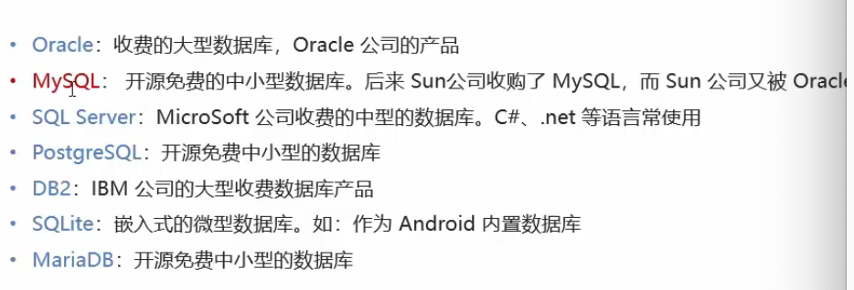

# Database （DB）

数据库是结构化信息或数据的有序集合，一般以电子形式存储在计算机系统中。通常由[数据库管理系统 (DBMS)](https://www.oracle.com/cn/database/what-is-database/#WhatIsDBMS) 来控制。在现实中，数据、DBMS 及关联应用一起被称为数据库系统，通常简称为数据库。

为了提高数据处理和查询效率，当今最常见的数据库通常以行和列的形式将数据存储在一系列的表中，支持用户便捷地访问、管理、修改、更新、控制和组织数据。另外，大多数数据库都使用结构化查询语言 (SQL) 来编写和查询数据。

https://www.oracle.com/cn/database/what-is-database/

分类：

- 关系型数据库
- 非关系型数据库
- 分布式数据库
- 面向对象数据库

# Database management system（DBMS）

- MySQL
- Oracle
- Microsoft SQL Server
- PostgreSQL
- DB2
- SQLite
- MariaDB

# （Structured Query Language）SQL

操作关系型数据库的语言

分类：

- DDL
- DCL
- DML/DQL