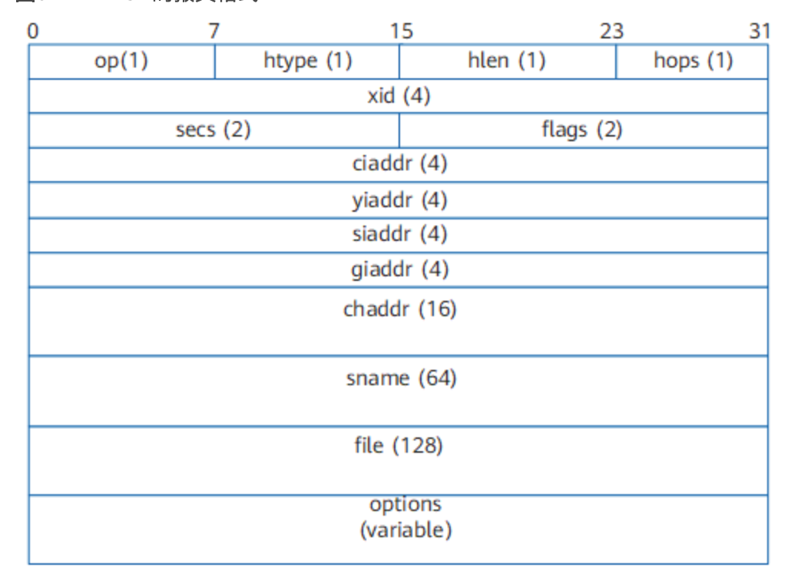

# DHCP message

DHCP一共有8种报文，分别为DHCP Discover、DHCP Offer、DHCP Request、DHCP ACK、DHCP NAK、DHCP Release、DHCP Decline、DHCP Inform

# DHCP query message

- OP：报文的操作类型。分为请求报文和响应报文。1：请求报文，2：应答报文。即client送给server的封包，设为1，反之为2。
  - 请求报文： DHCP Discover、DHCP Request、DHCP Release、DHCP Inform和DHCP Decline。
  - 应答报文： DHCP Offer、DHCP ACK和DHCP NAK。
- htype: hardware type 表示硬件类型，以太网的值为1
- hlen:hardware length 表示硬件地址长度，以太网的值为6。
- hops