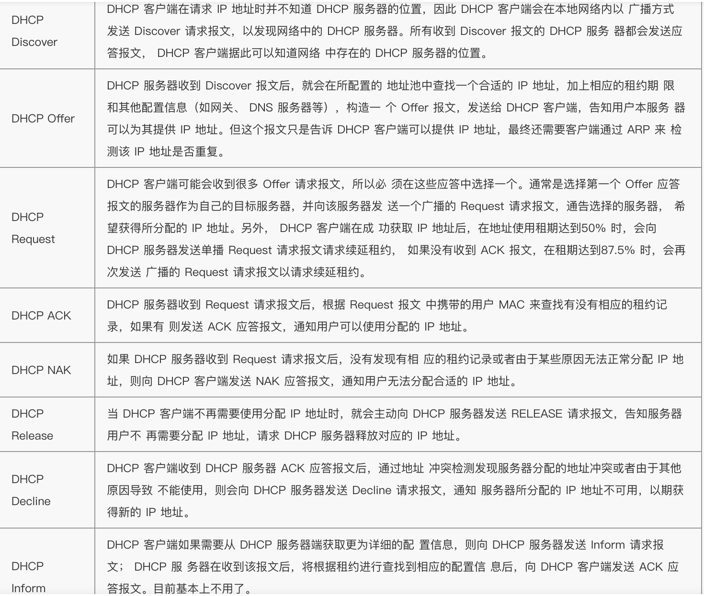
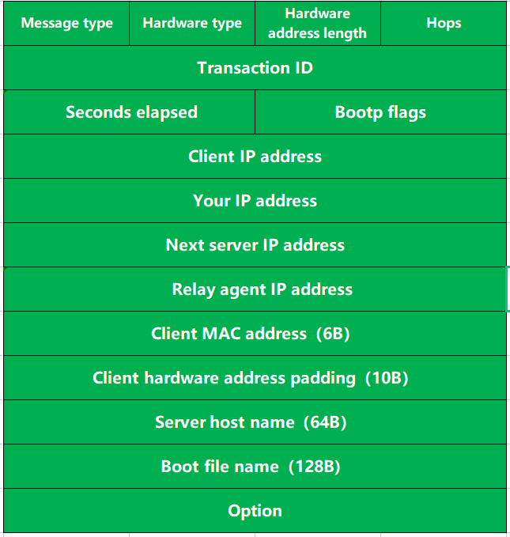
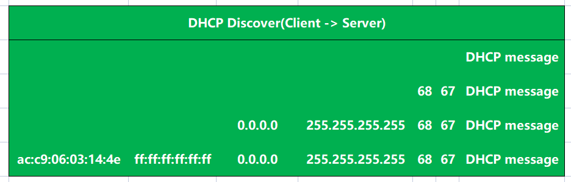
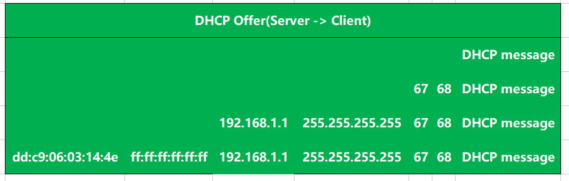
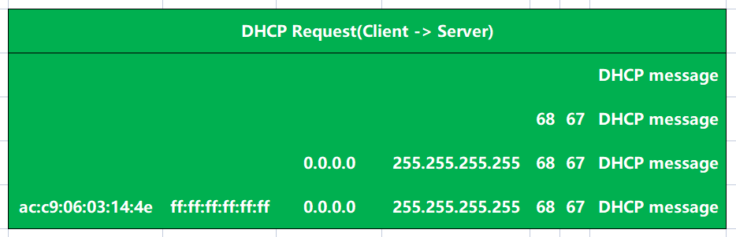
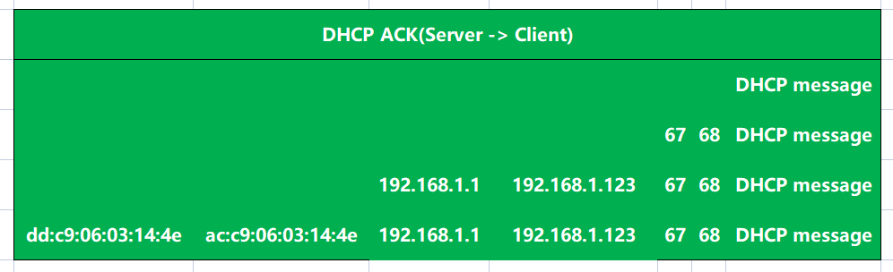

---

---

# DHCP message

DHCP一共有8种报文，分别为DHCP Discover、DHCP Offer、DHCP Request、DHCP ACK、DHCP NAK、DHCP Release、DHCP Decline、DHCP Inform

# DHCP message

- 
  - Message type：DHCP报文类型，共8种
  - Hardware type：硬件地址类型
  - Hardware address length：硬件地址长度
  - Hops：跳数
- Transaction ID：识别随机数
  - 

# DHCP 过程

- Discover
- Offer
- Request
- ACK/ NAK

