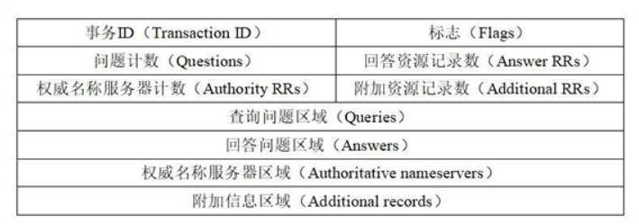
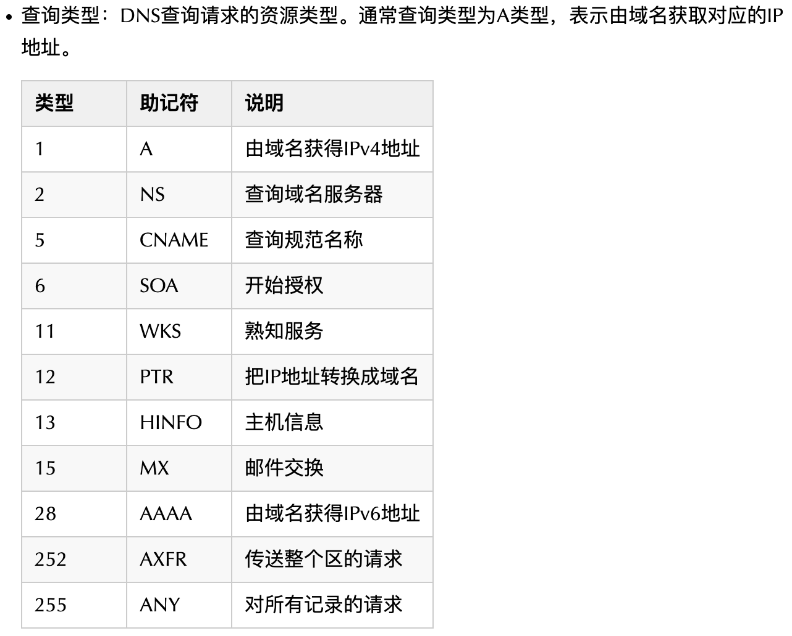

# Domain Name System

## Domain Name Space

Tree Structure

- Root
- Top Level Domain，TLD
- Second Level Domain
- SubDomain
- Host Name 
  - SubDomain+ Second Level Domain
  - Leftmost Domain

## Name Servers

- Root Name Servers
- Top Level Domain Name Servers
- Authoritative Name Servers
- Local Name Servers

## Domain Name Resolution

Recursive query/ Iterative query

- Cache
  - Browser cache
  - Operating System cache（hosts）
  - Router cache

- Local Name Server
- Root Name Server
- Top Level Name Server
- Authoritative Name Server

## DNS query message

- 
  - Transaction ID 事务ID，是DNS报文的标识
  - Flags 
    - Response
    - Opcode
    - Truncated
    - Recursion
    - Z
    - Non-authenticated data
- 
  - Questions
  - Answer RRs：Answer Resource Records
- 
  - Authority RRs：Authority Resource Records
  - Additional RRs：Additional Resource Records
- Queries
  - Name
  - Type
    - A：Address Record
    - NS：Name Server
    - CNAME：Canonical Name
    - SOA：Start of Authority
    - MX：Mail Exchanger
    - AAAA：IPv6 Address 
  - Class

## DNS response message

- 
  - Transaction ID
  - Flags
    - Response
    - Opcode
    - Authoritative
    - Truncated
    - Recursion desired
    - Recursion available
    - Z
    - Answer authenticated
    - Non-authenticated data
    - Reply code

- 
  - Questions
  - Answer RRs
- 
  - Authority RRs
  - Additional RRs
- Queries
- Answers

