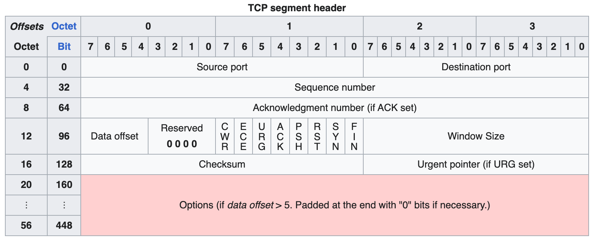

# PDU

- 
  - Source port
  - Destination port
- Sequence number
- Acknowledge number
- 
  - Data offset
  - Reserved
  - Flags
    - CWR
    - ECE
    - URG
    - ACK
    - PSH: push
    - RST: reset
    - SYN: synchronize sequence numbers
    - FIN: finish
  - Window Size
- 
  - Checksum
  - Urgent pointer

# Three-way handshake

- SYN=1 Seq=x
  - SYN=1 ACK=1  Ack=x+1 Seq=y
- ACK=1 Ack=y+1 Seq=x+1

# Four-way handshake

- FIN=1 ACK=1 Seq=x  Ack=y
  - ACK=1 Seq=y Ack=x+1
  - FIN=1  ACK=1 Seq=y Ack=x+1
- ACK=1 Seq=x+1 Ack=y+1

# Dos

Denial of Service attack

## DDos

Distributed Denail of Service attack

## SYN flood

