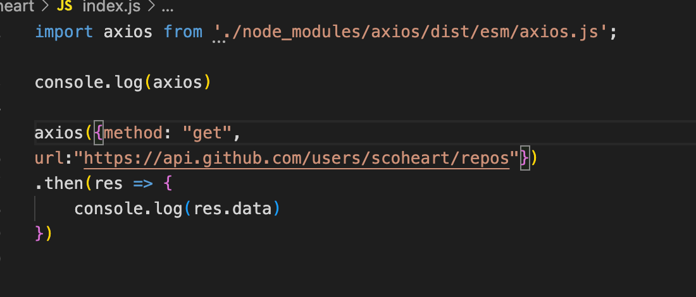

原始使用

- 需要使用
  - 绝对路径
  - 相对路径
  - .js后缀名不能省略
  - script标签 需要注明type=“module”


构建工具


3

webpack vite 


maven  gradle 

- 特定的目录结构
- 坐标 jar


文档


数据库 	

- 技术选型 MySQL
- 数据库设计


后端

- 技术选型 Java SSM
- 设计


接口

- 数据规范


前端

- 技术选型 React 
- 设计


需求分析

做一个电商   





```
package com.example.demo.dao;

import java.sql.Connection;
import java.sql.DriverManager;
import java.sql.ResultSet;
import java.sql.Statement;


public class PersonDao {

    public static final String URL = "jdbc:mysql://localhost:3306/js";
    public static final String USER = "root";
    public static final String PASSWORD = "shuhao201028";
    public static void main(String[] args) throws Exception{

        Class.forName("com.mysql.cj.jdbc.Driver");
        Connection connection = DriverManager.getConnection(URL, USER, PASSWORD);
        Statement statement = connection.createStatement();
        ResultSet resultSet = statement.executeQuery("select * from person_basic");
        while (resultSet.next()) {
            int id = resultSet.getInt("id");
            String name = resultSet.getString("name");
            int age = resultSet.getInt("age");
            String gender = resultSet.getString("gender");
            System.out.println(id + ", " + name + ", " + age + ", " + gender);
        }

    }
}

```

